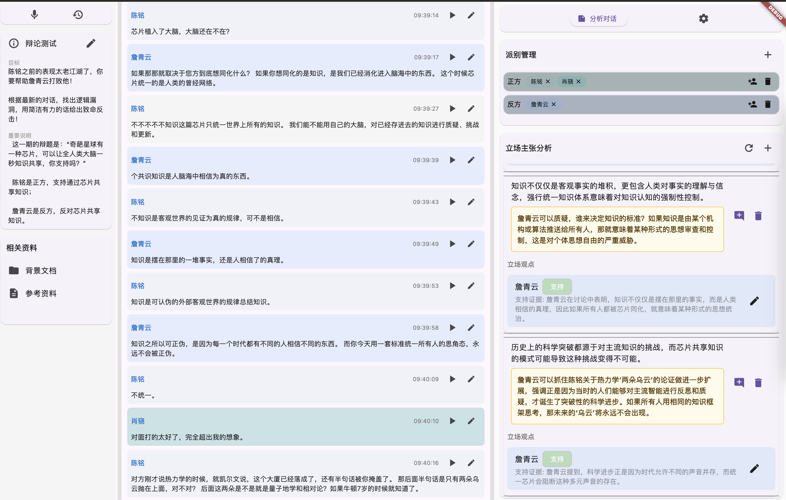
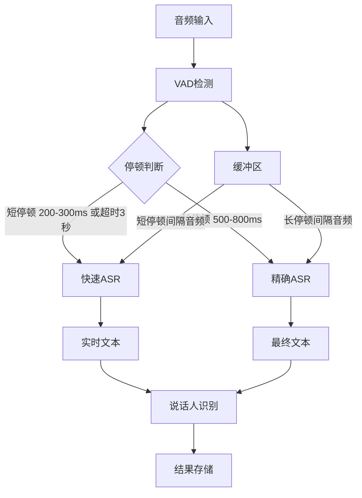

# SmartVoiceAssistant - 智能语音助手

一个专注于多场景应用的智能语音助手，能够实时记录对话内容、识别发言人、分析观点并提供即时建议。

## 背景

在各种重要场合（如商务谈判、课堂、竞标、公司会议、研讨会等）下，与会者往往需要：

1. 准确记录所有人的发言内容
2. 快速理解和分析各方观点
3. 及时获取相关法律法规参考
4. 在关键时刻得到专业建议

## 核心功能

- [x] 实时语音转文字
- [x] 多人发言识别
- [x] 会议内容实时记录
- [x] 观点分析，实时建议
- [ ] 基于预设知识库的建议生成

## 界面设计

## 技术方案

### 音频处理流程

### 处理流程说明

1. **音频格式**：

   - 前端采集：16kHz 单通道 int16
   - 后端处理：float32 格式
   - WebSocket 实时传输

2. **VAD 检测**：

   - **短停顿（200-300ms）**：用于触发快速 ASR；如果在 3 秒内未检测到短停顿，则直接触发快速 ASR 以获取快速反馈
   - **长停顿（500-800ms）**：用于触发精确 ASR，确保语义完整
   - 使用 Silero-VAD 模型进行检测

3. **ASR 处理**：

   - **快速模式**：采用短停顿或超时触发，响应时间快（<1 秒）
   - **精确模式**：结合上下文优化识别，确保高准确度

4. **说话人识别**：

   - 基于 pyannote/campplus 实现，结合 ASR 结果为最终文本添加说话人标签

5. **缓冲管理**：
   - 使用单一缓冲区存储音频数据
   - 根据停顿类型提取间隔音频：
     - 快速 ASR：从缓冲区取短停顿间隔的音频
     - 精确 ASR：从缓冲区取长停顿间隔的音频

### 核心模块

1. 语音处理

   - VAD
     - snakers4/silero-vad
   - ASR
     - SenseVoice 默认引擎（中英文优化，速度快）
     - Whisper 备选引擎（通用场景，高准确度）
   - Speaker Diarization

     - pyannote
     - funasr/campplus

   - 降噪和声音增强
     - todo

2. 内容分析

   - 目标和说明
   - 立场和人员管理
   - 立场分析和反驳、主张建议
     - 基于 OpenAI 兼容的 API，通过 LLM 接口提供建议

3. 客户端

   - 使用 Flutter 跨平台开发
   - 依赖模块支持 Windows/MacOS/Android/iOS
   - 测试环境：Macbook Pro M1
   - 本地运行，保证数据安全性

4. 数据存储
   - Isar DB 本地存储（会议记录、用户设置、全文检索）
   - Redis Stack 向量存储（语义搜索、RAG, todo）

## 免责声明

本软件仅供在合法场景下使用，用户需自行承担使用风险。不得在未经授权的场合进行录音，需遵守当地相关法律法规。

## 许可证

AGPL License

本项目遵循 AGPL 协议开源，欢迎贡献代码和建议。商业使用请联系获取授权。
